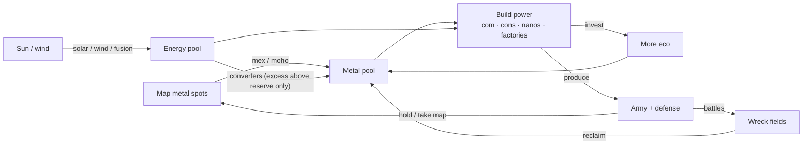
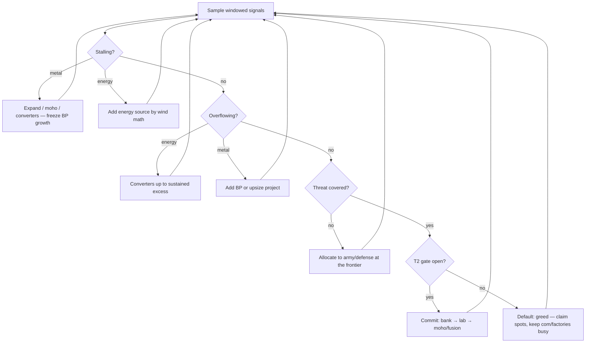

# Getting On Base — What Actually Matters in a BAR Game

**Date:** 2026-07-16 · **Status:** Theory (beta — hypotheses to validate against real captures)

All unit numbers below are pulled from the BAR repo (Armada units, current master):
mex 50M/500E (+`spot×0.001` m/s, −3 E/s) · moho 620M/7700E (×4 extraction, −20 E/s) ·
solar 155M (+20 E/s) · wind 40M/175E (+0–25 E/s, map wind) · T1 converter **1M**/1150E
(70 E/s → 1.0 m/s) · T2 converter 380M/21000E (600 E/s → 10.3 m/s) · fusion 3350M/18000E
(+750 E/s) · T1 lab 500M (BP 150) · T2 lab 2600M/15000E (BP 600) · commander BP 300,
+2 m/s, +30 E/s, 500/500 storage.

The baseball framing: **on-base percentage**. Games are mostly not won by highlight
plays — they're won by *never missing the free value*. This deck defines what the
"free value" is, mechanically, and the small set of ongoing formulas that tell you
when to take which action.

---

## Slide 1 — The engine: one compounding loop



Everything is this loop. Eco investment compounds (more income → more income).
Army does **not** compound — it decays (dies, obsoletes) — but it is the only thing
that buys the *input* to compounding: map. That asymmetry generates every strategic
decision in the game.

---

## Slide 2 — The price of metal (why mexes are non-negotiable)

Capital cost of **+1 metal/sec** of income, by source (typical 2.1-value spot,
metal-equivalents, build-energy ignored for clarity):

```
mex           ██ ~24 M                      (payback ~24 s)
moho upgrade  ████████ ~98 M  (+20 E/s upkeep)
fusion + T2conv farm  ████████████████████████ ~296 M
wind→T1conv (avg wind 10) ███████████████████████ ~280 M
solar→T1conv  ████████████████████████████████████████████ ~542 M
```

- Map metal is **10–20× cheaper** than manufactured metal. Every fight in the first
  ten minutes is, economically, a fight over 24-metal-per-m/s real estate.
- Therefore: **an unclaimed safe mex spot is a standing leak**, and killing an enemy
  mex (50M capital + 2.1 m/s flow + rebuild time + forced defense) is the
  highest-ROI thing a 100-metal raider can do. Early army exists to do mex math.
- Moho beats farms, farms beat nothing: the priority ladder is
  *new T1 spots → mohos on safe spots → fusion+converter farms* (farms only once
  the map is saturated or spots are unholdable).

---

## Slide 3 — Flow matching (the engine-verified core of "good eco")

Verified in the engine (`CUnit::AddBuildPower`): building drains
**M/s = metalCost × BP / buildTime** (energy likewise), and each build step is
**all-or-nothing** — if the team can't pay, progress is zero and the shortfall is
logged to `pull`. So eco quality is a flow-matching problem between three quantities:

```
        INCOME (m/s, e/s)
           ▲         ▲
   stall if spend    float if income
   > income+bank     > BP can spend
           ▼         ▼
   SPEND (queue drains) ◄──► BUILD POWER (capacity to spend)
```

Concrete drains (com = 300 BP): solar → 17.9 m/s for 8.7 s · wind → 7.5 m/s ·
T1 lab → 30 m/s for 17 s · **mex → 83 e/s for 6 s** (mexes are cheap metal but
spike energy — the classic "2–3 mex then energy" opening falls straight out of the
commander's 500E bank running dry).

**The band policy:** keep both resources off the rails —
never `pull − expense > 0` (stall: your BP is dead capital),
never sustained `excess > 0` (overflow: your income is dead capital).
Storage is not a goal; it's a shock absorber for lumpy spends (T2, fusion) and
windfalls (reclaim).

---

## Slide 4 — Energy and converters (gadget-verified)

From `game_energy_conversion.lua`: converters only consume energy **above
`storage × mmLevel`** (default 75%), capacity-capped, best-efficiency first,
re-evaluated 2×/sec. Consequences:

- **Converters cannot starve your builders** — they shed load *before* construction
  does. In a wind lull, converters auto-stop and your queue keeps drawing from the
  bank. Converter capacity is therefore also **energy-stall insurance** (a
  demand-response buffer), not just a metal printer.
- **Right amount of converters = your sustained excess.** Below that you overflow
  (waste); above it they idle (dead 1150E each). `mm_use / mm_capacity` near 100%
  while `e_excess ≈ 0` is the tell of a tuned energy economy.
- **Wind vs solar:** wind costs `40/avgWind` M per e/s vs solar's `7.75`. Wind wins
  above ~5 average wind on paper; variance (lulls, chain explosions) pushes the
  practical threshold to ~7–8. High-wind maps make converter-metal ~2× cheaper —
  greed scales with wind.
- **Combat energy is a hidden reserve requirement:** dgun (~500E), EMP, shields,
  radar/jamming all bill the same pool. The mmLevel reserve line is doing double
  duty as your weapons budget — going to 0 energy in a fight loses fights, not
  just build time.

---

## Slide 5 — The allocation frontier (eco vs army, i.e. your "get on base" dial)

Every second, metal splits across `{eco, build power, army, defense}`. There is no
universally optimal ratio — the optimum is **threat-conditioned**:

```
eco share of spend
100% ┤ ██
     │ ████            ← uncontested: pure land grab
 75% ┤ ██████
     │ ████████▄▄            ← first contact: raid/anti-raid trickle
 50% ┤ ██████▀▀▀▀▄▄▄▄
     │ █████▄     ▀▀▀▀▄▄▄▄   ← contested mid game: army ≈ eco
 25% ┤ ██████▀▄▄▄▄  ▲    ▀▀▀▀▄▄
     │ ██████     ▀▀│▀▄▄▄▄       ← late: production dominates
  0% └──┬──────┬────│──┬───────┬──
       0:00   5:00  T2 dip   15:00
```

The governing asymmetries:

1. **Eco compounds, army decays** → all else equal, the greedier player wins the
   long game. Greed is the default; army is what you're *forced* to buy.
2. **Defense + terrain is cheaper than attack** → a small defensive spend protects a
   large eco lead. This is what makes greed viable at all.
3. **Army buys map, and map is metal** → army spend is *indirect eco* when it claims
   or denies spots, and *pure waste* when it trades evenly in the middle of nowhere.
   Evaluate every engagement in mex-seconds, not kill counts.
4. **Punish or perish:** the only counter to a greedier opponent is to make the
   greed unsafe. If scouting shows naked eco and you can't/won't punish, you must
   out-greed — matching a greedy player with a balanced build just loses slower.

So "turning eco down to 50%" (your phrase) is exactly right, but the trigger is
informational: **allocation follows intel**. Which makes scouting the cheapest
eco upgrade in the game — it's what licenses your greed.

---

## Slide 6 — The T2 decision, quantified

T2 lab = 2600M + 15000E + 25000 BT. That is a *lump-sum bet* with a dead period:

```
m/s income        ___________----- ← moho/fusion payoff (steeper slope)
      ______-----`
 -----        ↘ ______↗
               dip: income growth stops while
               2600M+15000E drain into the lab+con
```

At 300 BP the lab alone is an 83-second, 31 m/s + 180 e/s drain — roughly *all* of a
healthy T1 economy. The three-condition rule for a clean transition:

1. **Bank first** — you need storage (mexes +50 each, com 500, labs +100) full enough
   to smooth the drain without stalling defense production.
2. **Stable frontier** — the dip is when timing pushes kill you; don't start it with
   a contested border.
3. **Commit hard** — a slow T2 is the worst T2 (long dip, delayed payoff). Assist
   with everything; the faster you're through, the shorter the vulnerability window.

Measurable after the fact: dip depth/length vs. the pre-T2 income trendline, and
time until the new slope crosses the old trend. That's a per-game "T2 grade."

---

## Slide 7 — The decision loop (the ongoing formulas)

The whole policy fits in one loop over windowed (~15–30 s) signals — all of them
already in our metric registry:

| Signal (windowed) | Condition | Action |
|---|---|---|
| `m_pull − m_expense` | > 0, sustained, energy fine | Income problem: claim spots / mohos / converters; **stop adding BP** |
| `e_pull − e_expense` | > 0, sustained | Build energy (wind if avgWind ≳ 7, else solar; fusion at T2) |
| `e_excess` | > 0 beyond converter headroom | Add converters up to sustained excess (T1 = 1M each — near-free) |
| `m_excess` | > 0, sustained | Add BP **or** upsize targets (bigger project soaks the float) |
| `build_power_util` | low, no stall | Factories idle / queue empty → produce (production IS spending) |
| `mm_use / mm_capacity` | ≈ 100% + e_excess > 0 | Converter-capped: more converters |
| threat differential | enemy frontier value > army+defense×k | Shift allocation to army/defense until covered |
| intel age | stale | Scout — information reprices every row above |
| T2 gate | income ≥ map-relative bar ∧ bank ≥ dip ∧ frontier stable | Commit to T2, all-in assist |



Note what's *absent*: unit micro, turn rates, per-weapon stats. Those decide
battles; the loop above decides whether you could afford the battles at all.

---

## Slide 8 — "On-Base Percentage" for BAR (the hypothesis to test)

Proposal: a composite **OBP = fraction of game time in which ALL fundamentals hold**:

1. No metal stall and no energy stall (`pull − expense ≈ 0` both pools)
2. No sustained overflow (`excess ≈ 0`, converters soaking the rest)
3. Commander never idle (300 free BP + best builder)
4. No factory idle while metal is available
5. Converter uptime ≈ 100% of capacity whenever excess exists
6. No safe, reachable mex spot left unclaimed
7. Intel fresh enough to justify the current allocation

**Prediction:** OBP correlates with win rate more strongly than APM, army value, or
any single metric — because each miss is a leak in the compounding loop, and
compounding punishes leaks super-linearly (a 10% early leak is not a 10% deficit at
minute 20).

Every component is computable from the v3 capture contract (team_frames tuples,
`mm_*` params, unit_frames + static_defs for com/factory idleness; spot claims need
map metal-spot positions — the one input we'd add). When real data lands, the
validation is: compute OBP per player per game, regress against outcome, then test
which component leaks are the most predictive — that ranking, not this deck, is the
real answer.

---

## Caveats

- **Beta throughout** (matches the contract addendum): reserve-line converter
  behavior and the build-drain formula are source-verified; everything downstream
  of them here is inference, priced with current-master Armada stats that drift
  with balance patches. `def_hash` exists precisely so these numbers stay honest.
- Spot values, start resources, and wind are map/modoption-dependent — all ratios
  above shift per map (which is itself a finding: **the greed thresholds are
  map-parameterized**, e.g. by average wind and spot density).
- Cortex/Legion analogues differ slightly in cost but not in structure.
